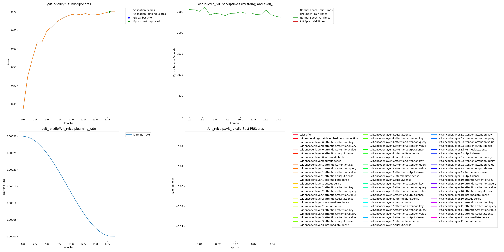

# ViT Tiny Classifier on RVL-CDIP Dataset

This example demonstrates training a Vision Transformer (ViT) for document classification on the RVL-CDIP dataset, with optional PerforatedAI dendrite integration.

## Installation

```bash
pip install transformers datasets torch torchvision tqdm lz4
```

For PerforatedAI support:
```bash
pip install perforatedai
```

## Quick Start

### Basic Training (Streaming Mode)

Streaming mode fetches data on-demand from HuggingFace - no disk space required:

```bash
python vit_tiny_classifier.py --train --max-samples 10000
```

### Optimized Streaming (Recommended for CPU)

For better throughput on CPU with 8 cores:

```bash
python vit_tiny_classifier.py --train --max-samples 160000 --num-workers 4 --queue-size 16 --stream-batch-size 512
```

### Training with Caching (Fastest)

Cache preprocessed data locally for maximum speed (requires ~10GB disk per 160k samples):

```bash
python vit_tiny_classifier.py --train --max-samples 160000 --cache-dir ./cache
```

### Training with PerforatedAI Dendrites

```bash
python vit_tiny_classifier.py --train --max-samples 160000 --cache-dir ./cache --use-dendrites
```

## Command-Line Arguments

### Data Options
| Argument | Default | Description |
|----------|---------|-------------|
| `--dataset` | `aharley/rvl_cdip` | HuggingFace dataset identifier |
| `--max-samples` | None | Limit samples (for testing/memory constraints) |
| `--cache-dir` | None | Cache preprocessed data to disk (faster, uses ~10GB) |

### Streaming Options
| Argument | Default | Description |
|----------|---------|-------------|
| `--stream-batch-size` | 512 | HuggingFace streaming fetch batch size |
| `--num-workers` | 2 | Number of prefetch worker processes |
| `--queue-size` | 8 | Prefetch queue size |

### Training Options
| Argument | Default | Description |
|----------|---------|-------------|
| `--train` | False | Run training |
| `--eval` | False | Run evaluation only |
| `--batch-size` | 64 | Training batch size |
| `--training-epochs` | 3 | Number of epochs |
| `--lr` | 3e-4 | Learning rate |
| `--weight-decay` | 0.05 | Weight decay |
| `--warmup-ratio` | 0.05 | Warmup ratio |
| `--seed` | 42 | Random seed |

### PerforatedAI Options
| Argument | Default | Description |
|----------|---------|-------------|
| `--use-dendrites` | False | Enable PerforatedAI dendrites |
| `--save-name` | `vit_rvlcdip` | Save name for PAI outputs |

## Device Support

The script automatically detects and uses the best available device:
- **CUDA**: NVIDIA GPUs (fastest)
- **MPS**: Apple Silicon GPUs (Mac M1/M2/M3)
- **CPU**: Fallback for all systems

## Dataset

The RVL-CDIP dataset contains 400,000 grayscale document images across 16 classes:
- letter, form, email, handwritten, advertisement
- scientific_report, scientific_publication, specification
- file_folder, news_article, budget, invoice
- presentation, questionnaire, resume, memo

## Model

Uses `vit-tiny` architecture with random initialization (not pretrained weights) from the HuggingFace model hub configuration.

## Results

Training with PerforatedAI dendrites achieves **70.02% accuracy** on 80k samples over 20 epochs:

```bash
python vit_tiny_classifier.py --train --max-samples 80000 --num-workers 4 --queue-size 16 --stream-batch-size 512 --eval --use-dendrites --training-epochs=20
```



## Output

Training output includes timing information:
```
Step 10: loss=2.7234, lr=0.000020, samples/sec=187.9
Step 20: loss=2.6891, lr=0.000040, samples/sec=204.5
```

## Troubleshooting

### Corrupt Images
Some images in RVL-CDIP may be corrupt. The script automatically skips these with a warning message.

### Out of Memory (OOM)
- Reduce `--batch-size`
- Reduce `--max-samples`
- Use streaming mode instead of `--cache-dir`
